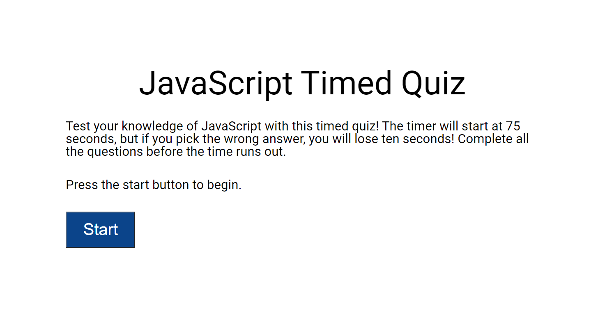

# JavaScript-quiz

## Description
Test your knowledge of Javascript basics and compare against your friends. This application stores your score to local storage so you can see your progress. 

## Instructions
1. Click the start button to begin answering questions. 
2. Every wrong answer reduces the amount of time you have to complete the quiz. Finish quicker for a higher score! 
3. At the end of the quiz, submit your initials to have your score listed in the high scores. 

## Technologies 
Technologies used:
- HTML
- CSS
- JavaScript

## Future Development
This was one of my first apps using JavaScript. I look forward to adding functions to shuffling the questions and the answers, refactoring the code to make it more effecient, and spicing up the CSS. 

## Contact Information
Contact me at abbynfrandsen@gmail.com

Access the quiz at https://abbynf.github.io/JavaScript-quiz/